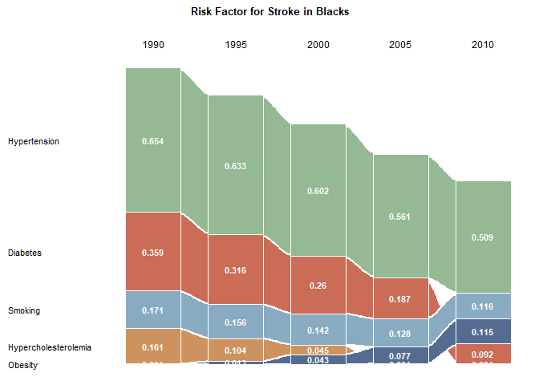

Assignment2
================
Tzu Yu Huang
2022-12-08

## 1. Set up and read in the data

``` r
library(reshape2)
library(ggplot2)
library(ggalluvial)
library(readxl)

sank <- read_excel("Assignment2/Stacked_column_stroke_blacks_noAF.xlsx", sheet = "Data", range = "A1:F6")
```

## 2. Transform the data so that it can be recognize by ggplot sankey package.

``` r
sank2 <-melt(sank)
names(sank2) <- c("risk_factors", "year", "value")
```

## 3. Plot the Sankey diagram, with white space

``` r
ggplot(sank2, aes(x = year, 
                  y = value, 
                  alluvium = risk_factors,
                  stratum = risk_factors)) +
geom_alluvium(aes(fill = risk_factors), 
                  alpha = 1, 
                  width = 1/2,  
                  size = 1, 
                  color = "white", 
                  decreasing = FALSE) +
geom_stratum(aes(fill = risk_factors), 
                  alpha = 1, 
                  width = 2/3,  
                  size = 1, 
                  color = "white", 
                  decreasing = FALSE) + 
# change the color  
scale_fill_manual(values = c("#CB6C56", "#CD925E", "#94B993", "#546C91", "#88ABC2")) +
# adding value on to the plot
geom_text(stat = "stratum", aes(label = value), colour = "white", size = 3, fontface = "bold", decreasing = FALSE) +
# adding title
ggtitle("Risk Factor for Stroke in Blacks") + 
theme(plot.title = element_text(face = "bold", size = (10), hjust = 0.5, margin=margin(0,0,20,0))) +
scale_x_discrete(position = "top") + 
# adjust x axis labels
theme(axis.text.x = element_text( color = "black"), axis.title.x = element_blank()) +
# adding y axis labels
geom_text(stat = "stratum",aes(label = ifelse(year == "1990", risk_factors," ")), hjust = 0, nudge_x = -1.75, color = "black", size = 3,  decreasing = FALSE) +
# remove "value" on y axis
theme(axis.title.y = element_blank()) +
# remove background
theme(legend.position = "none",
           panel.background = element_blank(),
           panel.grid.major = element_blank(),
           panel.grid.minor = element_blank(),
           axis.text.y = element_blank(),
           axis.ticks = element_blank())
```

<!-- -->

## 4. Plot the Sankey diagram, without white space

``` r
ggplot(sank2, aes(x = year, 
                  y = value, 
                  alluvium = risk_factors,
                  stratum = risk_factors)) +
geom_alluvium(aes(fill = risk_factors), 
                  alpha = 1, 
                  width = 1/2,  
                  size = 1, # remove color option
                  decreasing = FALSE) +
geom_stratum(aes(fill = risk_factors), 
                  alpha = 1, 
                  width = 2/3,  
                  size = 1, 
                  color = FALSE, # change color option
                  decreasing = FALSE) + 
scale_fill_manual(values = c("#CB6C56", "#CD925E", "#94B993", "#546C91", "#88ABC2")) +
geom_text(stat = "stratum", aes(label = value), colour = "white", size = 3, fontface = "bold", decreasing = FALSE) +
ggtitle("Risk Factor for Stroke in Blacks") + 
theme(plot.title = element_text(face = "bold", size = (10), hjust = 0.5, margin=margin(0,0,20,0))) +
scale_x_discrete(position = "top") + 
theme(axis.text.x = element_text( color = "black"), axis.title.x = element_blank()) +
geom_text(stat = "stratum",aes(label = ifelse(year == "1990", risk_factors," ")), hjust = 0, nudge_x = -1.75, color = "black", size = 3,  decreasing = FALSE) +
theme(axis.title.y = element_blank()) +
theme(legend.position = "none",
           panel.background = element_blank(),
           panel.grid.major = element_blank(),
           panel.grid.minor = element_blank(),
           axis.text.y = element_blank(),
           axis.ticks = element_blank())
```

<!-- -->
